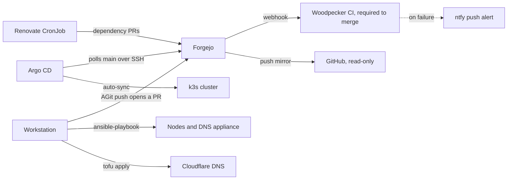

# Homelab

A four-node k3s cluster on Raspberry Pi CM4 hardware, built and run with the practices a
platform team uses: infrastructure as code, GitOps delivery, required CI checks on every
pull request, encrypted secrets, alerting, and backups with restore drills.

This repo holds the documentation: runbooks, architecture, and decision records. It's the
only public repo of the five. It contains no infrastructure code and no secrets. The code
it describes lives in four private repos, summarized in [How changes ship](#how-changes-ship).

## At a glance

| Practice | How this homelab does it | Read more |
|---|---|---|
| Infrastructure as code | Ansible provisions the nodes, their UFW rules, and k3s. OpenTofu manages Cloudflare DNS, with remote state in S3. | [Ansible](docs/build/ansible.md) · [Terraform](docs/build/terraform.md) |
| GitOps delivery | Argo CD deploys every app and platform service on the cluster from Git, as an app of apps. For cluster workloads, merging to `main` is the deploy. | [Deployment pattern](docs/deploy/index.md) |
| Continuous integration | Woodpecker, running on the cluster, gates every pull request in all five repos: gitleaks, `kubeconform`, `ansible-lint`, `tofu validate`, and a strict docs build. Branch protection requires a passing run and blocks direct pushes to `main`. | [Required checks](docs/deploy/woodpecker.md#required-checks-and-branch-protection) |
| Secrets management | SOPS and age encrypt what the workstation reads. Sealed Secrets encrypts what the cluster reads. gitleaks scans each commit locally and each repo's full history in CI. | [Repositories](docs/concepts/repositories.md) |
| Dependency updates | Renovate opens pull requests in all five repos for Helm charts, container images, k3s, OpenTofu providers, and hooks. Nothing merges unattended. | [Renovate](docs/deploy/woodpecker.md#renovate-keep-dependencies-and-image-tags-current) |
| Patch management | Security updates install nightly. Kernels and reboots wait for a supervised rolling update with canary and health gates. | [OS patching](#os-patching) |
| Observability | Prometheus, Grafana, Loki, and Alloy, plus black-box probes of each app's URL. A dead man's switch outside the cluster catches a dead Prometheus or Alertmanager. | [Observability](docs/build/observability.md) |
| Backup and recovery | Velero, etcd snapshots, and database dumps land in S3 on the NAS, then sync off-site nightly. Restore drills cover the secrets chain, PostgreSQL dumps, and Velero volumes. | [Backups](docs/build/backups.md) · [Disaster recovery](docs/operate/disaster-recovery.md) |
| Identity | Authelia provides OIDC and forward-auth single sign-on, backed by an lldap directory. | [Identity](docs/concepts/identity.md) |
| Network security | A default-deny zone firewall between VLANs, UFW on each node and the DNS appliance, and Tailscale subnet routers with failover for remote access. | [Network](docs/build/network.md) · [Firewall decision](docs/reference/decisions/zone-based-firewall.md) |
| Docs as code | MkDocs with strict link checks and Vale prose linting, both in CI. Decision records capture the major design choices. | [Decision records](docs/reference/decisions/index.md) |

## How changes ship

Every change to the cluster, the nodes, and DNS goes through a pull request, and branch
protection enforces it. Forgejo, self-hosted on the cluster, is the primary Git host.
GitHub holds a read-only push mirror.



Each repo has its own required checks, and the change applies through the tool that owns
that layer:

| Repo | Holds | Pull-request checks | Applies through |
|---|---|---|---|
| `homelab-manifests` | Argo CD `Application`s, Helm values, raw manifests, and SealedSecrets | gitleaks; `kubeconform -strict` against Kubernetes and CRD schemas | Argo CD auto-sync on merge |
| `homelab-ansible` | Node provisioning, k3s install, UFW rules, Tailscale, and patching playbooks | gitleaks; pre-commit: `ansible-lint` and YAML checks | `ansible-playbook` from the workstation |
| `homelab-terraform` | OpenTofu modules for Cloudflare DNS and UniFi | gitleaks; `tofu fmt -check` and `tofu validate` | `tofu apply` from the workstation, with state in Garage S3 |
| `homelab-secrets` | The SOPS-encrypted day-zero export of the Sealed Secrets signing key | gitleaks; pre-commit: SOPS encryption checks | Read only in disaster recovery, if the Garage copy is gone |
| `homelab-docs` | This documentation | gitleaks; `mkdocs build --strict` and Vale | Merge to `main`, mirrored to GitHub |

A failed check sends an ntfy push notification with a link to the run.

## How it's maintained

Day-two work runs through the same pull-request flow, and the cluster reports when it
needs attention.

### Dependency updates

Renovate runs daily at 02:00 UTC as a CronJob on the cluster and scans all five repos.
It opens pull requests against Forgejo for Helm charts, container images in Helm values
and raw manifests, k3s releases, OpenTofu providers, pre-commit hooks, CI images, and
the docs' Python dependencies. In `homelab-manifests`, OSV vulnerability alerts arrive
labeled `security`.

Nothing merges unattended. A merge to `homelab-manifests` is a deploy, and `kubeconform`
validates schema, not behavior, so every update waits for review.

### k3s upgrades

The system-upgrade-controller, deployed by Argo CD, upgrades k3s from `Plan` resources.
It drains and upgrades the control plane first, then the agents one at a time. Each
agent waits until the control plane reports the new version, so no kubelet runs ahead of
the API server.

Renovate proposes each k3s release once it's seven days old, with minors and patches in
separate pull requests. Merging one starts the roll.

### OS patching

Patching runs in two tiers:

- **Nightly, unattended.** `unattended-upgrades` installs Debian security updates and
  point releases, plus packages from the Raspberry Pi archive and Tailscale, without
  rebooting. Kernel and firmware packages wait for the supervised tier.
- **Supervised, on demand.** `just update-all` runs an Ansible playbook that updates one
  host at a time. It drains each k3s node first and reboots only when an update requires
  it.

Node-exporter reports pending updates, pending reboots, and services still running
replaced libraries. Prometheus alerts on each, so an alert, not a calendar, says when to
run the supervised tier.

The supervised playbook stops before it can turn one bad node into a cluster outage:

- The first node it changes is a canary. The playbook waits five minutes and rechecks
  the cluster before the next drain.
- Before and after each node, every pod that hasn't completed must be `Ready`, and every
  Argo CD app `Healthy`.
- Before each drain, every other node must have 4 GiB of disk free for the pods it's
  about to receive.
- At the first failure, the playbook uncordons the node and stops.

### Alerting

Alertmanager routes alerts to ntfy as push notifications. Black-box probes check
that each app's URL answers end to end, not only that its pod is running.

The `Watchdog` alert fires continuously and pings Healthchecks.io, outside the cluster,
every minute. If Prometheus, Alertmanager, or the network path out of the cluster fails,
the pings stop and Healthchecks.io alerts on its own channel.

### Backups

Every job writes to its own bucket on a Garage S3 store on the NAS, each with its own
least-privilege key. A nightly sync copies the whole store off-site to Backblaze B2.

| What | Schedule | Retention or destination |
|---|---|---|
| App persistent volumes (Velero with kopia), excluding metrics, logs, and caches | Daily | 7 days |
| etcd snapshots | Every 12 hours | On the control plane and in Garage |
| Sealed Secrets signing keys, encrypted | Daily | Garage |
| PostgreSQL dumps, one per database | Nightly | Garage |
| The Garage store and the photo library | Nightly | Backblaze B2 |

Three restore drills back these jobs:

- The secrets recovery chain, on 2026-07-17. The drill ran read-only and left the live
  cluster untouched.
- A PostgreSQL dump restore, compared with the source by row count and MD5 checksum
  rather than by exit code.
- A Velero backup and restore of a local-path volume.

## Known trade-offs

The current design has these limits:

- **One control plane.** ruby is the only k3s server and etcd member. If it dies, the
  apps keep serving, but nothing can deploy, scale, or reschedule until it's recovered.
  Scheduled etcd snapshots and a documented restore path cover that case.
  See [Kubernetes](docs/build/kubernetes.md) and [Disaster recovery](docs/operate/disaster-recovery.md).
- **One NFS server.** topaz serves the default storage class from a SATA SSD, so a topaz
  reboot stalls every NFS-backed pod.
- **Local-path apps stay on one node.** SQLite apps keep their data on one node's
  eMMC. Draining that node takes them down, and losing it means a Velero restore from
  the last daily backup. See [Storage](docs/concepts/storage.md).
- **The UniFi firewall isn't codified.** The `ubiquiti-community/unifi` provider this
  repo uses has no zone-based firewall resources, so the zone policies exist only as
  manual configuration on the UDM. The `unifi/` module is a draft that no one has
  applied.
- **Some NAS state lives outside Git.** No repo holds the Docker Compose files for
  Immich, Audiobookshelf, and PostgreSQL, or the NAS backup timers.
- **OpenTofu applies from the workstation.** CI validates the modules but doesn't plan or
  apply them.

## Hardware

| Component | Spec |
|---|---|
| Cluster | Turing Pi 2 with 4× Raspberry Pi CM4, 8 GB RAM each |
| Network | Ubiquiti UDM: VLANs, zone firewall, and DHCP |
| NAS | UGREEN DXP6800 Pro: bulk storage, PostgreSQL, Garage S3, Immich, and Audiobookshelf |
| Home Assistant | Proxmox on a repurposed Mac mini, running Home Assistant OS in a VM |
| DNS | AdGuard Home on a dedicated Raspberry Pi 3 B, off the cluster |

## What runs on it

- **Platform, on the cluster:** Argo CD, Forgejo, Woodpecker, Renovate, Traefik on the
  Gateway API, cert-manager, MetalLB, Sealed Secrets, Authelia, lldap, Vaultwarden, and
  ntfy.
- **Applications, on the cluster:** Nextcloud with Collabora, Paperless-ngx, Miniflux,
  Actual Budget, Donetick, and Homepage.
- **Applications off the cluster, routed through its Traefik:** Immich and Audiobookshelf
  on the NAS, and Home Assistant on its VM.

The [App catalog](docs/reference/app-catalog.md) tracks each app's status, and
[Service selection](docs/reference/service-selection.md) records the reasoning behind
each choice.

## Work on these docs

The runbooks live as Markdown under `docs/`, and
[MkDocs Material](https://squidfunk.github.io/mkdocs-material/) renders them as a static site. The Markdown source
renders natively in GitHub as a fallback view.

### Preview locally

```bash
python -m venv .venv
source .venv/bin/activate   # fish users: source .venv/bin/activate.fish
pip install -r requirements.txt
mkdocs serve
```

Then open <http://127.0.0.1:8000>. Live-reload watches `docs/` for changes.

### Build the static site

```bash
mkdocs build --strict
# Output in ./site/
```

`--strict` is what CI runs. It fails the build on a broken internal link or anchor, so a
local build without it passes where the pipeline won't.

### Lint the prose

Prose follows the [Google developer documentation style guide](https://developers.google.com/style),
checked with [Vale](https://vale.sh):

```bash
sudo pacman -S vale                # once
vale sync                          # fetches the Google style package
vale --minAlertLevel=warning docs/
```

CI runs gitleaks, `mkdocs build --strict`, and `vale --minAlertLevel=warning`. A leaked
secret, broken link, broken anchor, or style violation fails the pipeline, and a failed
pipeline blocks the merge.

### Contribute

Every change goes through a branch and a pull request, including README and runbook
edits. Branch protection rejects direct pushes to `main` and blocks a merge until CI
passes.

[STYLE.md](STYLE.md) codifies the prose style, page structure, admonition semantics,
anchor rules, and public-repo constraints. The reference implementations are
`docs/build/backups.md` and `docs/deploy/forgejo.md`.

Pull requests are AGit pushes to Forgejo. GitHub is a read-only mirror:

```bash
git push origin HEAD:refs/for/main -o topic=TOPIC
```
