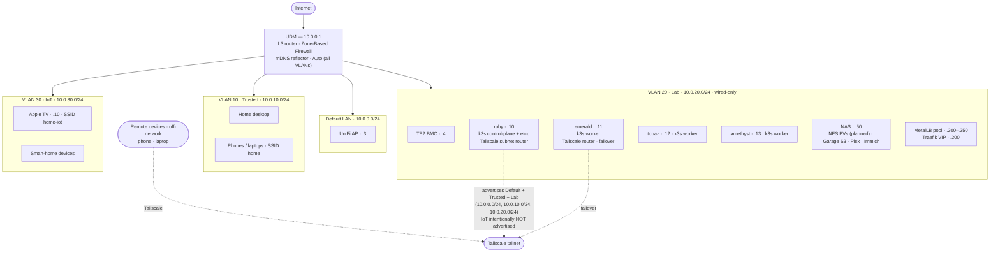

# Runbook 2: Network Segmentation and VPN

VLAN plan, firewall, and remote access via Tailscale. Sets up the network model that every later runbook assumes (cluster nodes on Lab VLAN, MetalLB pool reserved, global mDNS reflector, Tailscale subnet routing).

| | |
|---|---|
| **Difficulty** | Intermediate |
| **Time Estimate** | 2–3 hours |
| **Runs On** | UDM + a Turing Pi node for Tailscale subnet routing |
| **Prerequisites** | UDM powered and reachable on default LAN |
| **Targets** | UniFi OS 5.x · Network application 10.x |

!!! warning "UDM version assumption"
    Step 3 (firewall) targets the **Policy Engine / Zone-Based Firewall** introduced in UniFi OS 4 and current in 5.x. On UniFi OS 3.x or earlier, the firewall is configured under **Settings → Firewall → LAN IN** with a different model (default-allow + targeted drops) and these steps do not apply 1:1. Check **System → About** in the UniFi UI to confirm your version.

## Network Plan

This table is the authoritative source for every later runbook (Terraform `unifi_network` resources, Ansible inventory IPs, MetalLB pool config). Change it here first, propagate everywhere else.

| VLAN | Name | ID | Subnet | Gateway | Static range | DHCP range |
|---|---|---|---|---|---|---|
| (untagged) | default | — | `10.0.0.0/24` | `10.0.0.1` | `.2–.99` | `.100–.250` |
| 10 | trusted | 10 | `10.0.10.0/24` | `10.0.10.1` | `.10–.99` | `.100–.250` |
| 20 | lab | 20 | `10.0.20.0/24` | `10.0.20.1` | `.10–.99` | `.100–.199` |
| 30 | iot | 30 | `10.0.30.0/24` | `10.0.30.1` | `.10–.99` | `.100–.250` |

**Globals**

- DHCP lease: 86400s (1 day)
- IPv6: disabled on both WAN and LAN (see Step 1 note)
- IGMP snooping: **on** (on the UDM's built-in switch, see Step 1d) — required for mDNS reflector to forward multicast cleanly across VLANs
- Multicast DNS (mDNS): **global gateway reflector set to Auto** — the UDM retransmits common mDNS (AirPlay, Cast, HomeKit, Bonjour) across **all** VLANs; it is not a per-network toggle. Custom mode (whitelist services, scope to chosen VLANs) is the hardening option — see Step 1e
- UDM upstream DNS: `1.1.1.1` (Cloudflare). Client DNS is handed off to a dedicated AdGuard Home appliance (`pyrite`, `10.0.0.20`) — see Step 3d and [Runbook 17](17-adguard-home.md)
- MetalLB pool: `10.0.20.200–.250` (reserved within Lab VLAN, outside DHCP)

!!! note "Why NAS sits on Lab, not Trusted"
    NAS (`10.0.20.50`) will provide NFS persistent volumes to in-cluster workloads (planned — no StorageClass exists yet). Cluster ↔ NAS traffic stays intra-VLAN with no firewall hop, keeping the storage path low-latency. Trusted devices reach SMB and the UGOS Pro web UI via the per-service `trusted-to-nas-smb` policy (Step 3c). Dual-NICing the UGREEN DXP6800 Pro across Lab+Trusted is an alternative if SMB performance from desktops ever bottlenecks; not chosen for v1.

!!! note "Guest VLAN — deferred"
    2026 homelab best-practice typically adds a Guest VLAN (visitors get internet only, isolated from everything else). Skipped here to keep the initial scope tight. Easy 10-minute future addition: VLAN 40 `guest`, separate SSID with client isolation, zone-matrix Block to all other zones.

### Static IP allocations

Within the static range of each VLAN. Cluster nodes get their static IP from `dietpi.txt` at first boot (R3 Step 3, via DietPi's `ifupdown` — not netplan, and not a UDM DHCP reservation) so they boot deterministically even if UDM is down.

| Device | VLAN | IP | Assignment |
|---|---|---|---|
| UDM | default | `10.0.0.1` | UDM default |
| UniFi AP | default | `10.0.0.3` | UDM DHCP reservation |
| pyrite (AdGuard Home — DNS) | default | `10.0.0.20` | dietpi.txt static |
| marcasite (AdGuard Home — DNS failover, optional) | default | `10.0.0.21` | dietpi.txt static |
| Turing Pi 2 BMC | lab | `10.0.20.4` | UDM DHCP reservation |
| ruby (k3s control plane, Tailscale subnet router) | lab | `10.0.20.10` | dietpi.txt static |
| emerald (Tailscale subnet router failover) | lab | `10.0.20.11` | dietpi.txt static |
| topaz | lab | `10.0.20.12` | dietpi.txt static |
| amethyst | lab | `10.0.20.13` | dietpi.txt static |
| slate (Mac mini — Proxmox host for Home Assistant) | lab | `10.0.20.20` | static (set at Proxmox install) |
| Home Assistant OS (VM on slate) | lab | `10.0.20.21` | UDM DHCP reservation |
| UGREEN DXP6800 Pro NAS | lab | `10.0.20.50` | UDM DHCP reservation |
| Apple TV | iot | `10.0.30.10` | UDM DHCP reservation |

### WiFi SSID mapping

| SSID | VLAN | Devices |
|---|---|---|
| `home` | 10 (trusted) | phones, laptops |
| `home-iot` | 30 (iot) | Apple TV, smart home devices |

Lab VLAN is wired only — no SSID.

## Topology



*Solid arrows are UDM's L3 routing between VLANs — every inter-VLAN hop is subject to the Policy Engine zone matrix (Step 3), with Lab unable to initiate to any other zone. Dotted lines are Tailscale: off-network devices reach the LAN through the tailnet, with ruby (primary) and emerald (failover) advertising the Default/Trusted/Lab subnets into it. The UDM's mDNS reflector (Auto) retransmits across all VLANs; see [VLAN Architecture](#vlan-architecture) for the per-zone rationale.*

## VLAN Architecture

Each VLAN has a distinct trust level and a deliberate reason for existing:

- **Default LAN — `10.0.0.0/24`:** infrastructure management plane. UDM and AP live here. Treat as semi-trusted; you do not want random devices landing on it.
- **VLAN 10 — Trusted (`10.0.10.0/24`):** your personal devices. Phones, laptops, home desktop. The global mDNS reflector lets them discover AirPlay/Cast/Bonjour services on IoT and Lab without switching networks.
- **VLAN 20 — Lab (`10.0.20.0/24`):** the k3s cluster and NAS. Wired only, no SSID. The NAS hosts user-facing services (Plex, Immich, AirPlay receivers); the global mDNS reflector makes them discoverable from phones on Trusted and the Apple TV on IoT. Blast radius if a workload escapes the cluster is bounded by the zone matrix (Lab cannot initiate to any other VLAN).
- **VLAN 30 — IoT (`10.0.30.0/24`):** smart home gear including the Apple TV. The global mDNS reflector lets phones on Trusted discover the Apple TV for AirPlay, and lets the Apple TV discover Plex on the NAS. Internet egress allowed (most IoT needs cloud services) but no inbound from anywhere except specific Home Assistant / Plex flows.

!!! note "Why Apple TV is on IoT and not Trusted"
    Apple TV is a closed-firmware appliance that talks to Apple's cloud services. Putting it on Trusted would let it reach your personal devices unnecessarily. Putting it on IoT with the mDNS reflector enabled is the Ubiquiti-recommended pattern: segmentation preserved, AirPlay still works because the reflector relays mDNS announcements across VLANs.

## Step 1: Create VLANs on UDM

In UniFi Network → **Settings → Networks**, create one network per VLAN row in the table above. For each:

1. **Name** and **VLAN ID** as in the Network Plan.
2. **Gateway/Subnet:** matches the table.
3. **DHCP Mode:** DHCP Server. Set **DHCP Range** to the values from the table (Lab uses `.100–.199`, others use `.100–.250`).
4. **DHCP DNS Server:** Auto (UDM). UDM forwards to upstream — set the upstream in Step 1a below.
5. **Multicast DNS:** leave the per-network field at its default — on this controller mDNS reflection is **not** a per-network toggle but a single global gateway setting, configured in **Step 1e** below.
6. **IGMP Snooping:** configured on the UDM in Step 1d (not per-VLAN here).
7. **IPv6 Interface Type:** None (disable).

### Step 1a: UDM upstream DNS

UDM Settings → **Internet → Primary Connection → Advanced → DNS Server**: set to `1.1.1.1` and `1.0.0.1` (or your preferred upstream — Quad9 `9.9.9.9` is the other common choice).

### Step 1b: Reserve the MetalLB range from DHCP

In UniFi → Networks → **Lab** → DHCP → **Advanced → DHCP Exclude IP Range**, add `10.0.20.200–10.0.20.250`. The DHCP pool is already limited to `.100–.199`, but the exclude range belt-and-suspenders prevents an accidental DHCP-range widening from colliding with MetalLB-owned IPs.

### Step 1c: Disable IPv6 (WAN side too)

UDM Settings → **Internet → Primary Connection → IPv6**: set to **Disabled**.

!!! warning "IPv6 has two settings — both matter"
    The per-VLAN IPv6 toggle (Step 1, item 7) only stops UDM from handing IPv6 to LAN clients. It does **not** stop UDM from accepting an IPv6 prefix from your ISP. Without disabling at WAN, clients could still be reachable over IPv6 via SLAAC even though you "disabled IPv6 on the LAN."

### Step 1d: Enable IGMP snooping on the UDM

UniFi → **UniFi Devices → your UDM → Settings → Services → IGMP Snooping** → toggle on.

This is a device-level setting on the UDM's built-in switch, not per-VLAN. Without IGMP snooping, the switch floods all multicast traffic (including mDNS announcements and the actual AirPlay/Chromecast streams) to every port in the VLAN — wasted bandwidth and an easy way to confuse other multicast-using devices. With snooping on, the switch tracks which ports have devices that joined a multicast group and only forwards to those ports.

!!! note "Why this matters with mDNS reflector enabled"
    The mDNS reflector (Auto) multiplies multicast traffic across every VLAN it reflects to. IGMP snooping is what keeps that traffic targeted instead of broadcast-flooding the whole switch. Enable mDNS reflector without IGMP snooping and you'll see strange symptoms — slow IoT discovery, dropped AirPlay sessions, sometimes whole switch-CPU spikes.

### Step 1e: Enable the global Multicast DNS proxy

mDNS reflection is a single gateway-level setting, not per-network. UniFi → **Settings → Networks → Global Network Settings → Multicast DNS** (UI labels vary by Network app version; on a UDM it lives under the gateway/global network settings, not on an individual network). Set the mode to **Auto**.

**Auto** retransmits common mDNS service announcements (AirPlay, Chromecast, HomeKit, Bonjour) across **all** VLANs, so phones on Trusted and the Apple TV on IoT can discover Plex/AirPlay receivers on the NAS in Lab. Because Auto reflects everywhere, the Default management VLAN sees the announcements too — harmless here, but the reason Custom exists.

!!! note "Custom mode — the hardening option"
    **Custom** lets you whitelist specific service types (AirPlay, HomeKit, Matter) and scope each to chosen source/destination VLANs, instead of reflecting everything to everywhere. It's quieter on the wire, easier to audit, and keeps mDNS off VLANs that don't need it (e.g. Default). Auto is the simpler default and what this build runs today; switch to Custom when you want tighter control.

## Step 2: Connect devices to VLANs

VLAN networks are inert until devices are attached. Two paths: WiFi (SSID-to-VLAN binding) and wired (switch port profile).

### Step 2a: Create WiFi SSIDs

UniFi Network → **WiFi → Create New SSID** for each row in the SSID mapping table:

| SSID | Network | Notes |
|---|---|---|
| `home` | Trusted | personal devices |
| `home-iot` | IoT | Apple TV, smart home |

For each SSID: select the matching network from the **Network** dropdown, set a strong password (store in Vaultwarden), and enable **PMF (Protected Management Frames)** as Required or Optional — prevents deauth attacks on modern clients.

### Step 2b: Configure wired switch port profiles

Every wired device needs its switch port assigned to the right network. By default, switch ports are on the Default LAN — meaning a desktop you cable up will land on `10.0.0.0/24` regardless of which VLAN you intended.

UniFi → **UniFi Devices → your UDM → Ports**. For each relevant port click into it and set **Native VLAN / Network** to the right VLAN:

| Port use | Native network |
|---|---|
| Home desktop | Trusted (VLAN 10) |
| ruby, emerald, topaz, amethyst (Turing Pi 2 ethernet) | Lab (VLAN 20) |
| AP uplink (and any future downstream switch) | Default (or a trunk allowing all VLANs) |

!!! note "Access vs trunk ports"
    A port set to a single Native network is in **access mode** — it carries one untagged VLAN. Use this for endpoint devices (desktop, cube node, IoT device).

    A port that needs to carry multiple VLANs (uplink to another switch, port for a virtualization host with tagged VLAN interfaces) should be left on Default with **all VLANs allowed** — this is **trunk mode** and how the AP gets all SSIDs/VLANs to broadcast.

### Step 2c: Apple TV DHCP reservation

Connect the Apple TV to the `home-iot` SSID. After it gets an initial DHCP lease, find it in **UniFi → Clients → Apple TV → Settings → Fixed IP Address** and set to `10.0.30.10` (per the Static IP allocations table). Reboot the Apple TV to apply.

## Step 3: Firewall with Policy Engine (Zone-Based)

UniFi OS 4+ moved the firewall from the legacy `LAN IN / LAN OUT` rule list into the **Policy Engine**, which uses zones and a zone matrix. The model:

- **Zones** group networks. Built-in zones include Internal, External (WAN), Gateway, VPN, Hotspot/Guest, DMZ.
- **Zone Matrix** sets the default action (Allow / Block) between every pair of zones.
- **Policies** override the matrix for specific flows (source zone, destination zone, ports).

The big win: **default-deny between custom zones is built in.** You list only what's allowed; everything else is dropped.

### Step 3a: Create custom zones

UniFi → **Settings → Policy Engine → Zone Matrix → Add Zone** (UI labels may vary slightly between Network application versions — look for zone configuration under Policy Engine). Create three zones and assign each VLAN:

| Zone | Networks |
|---|---|
| Trusted | VLAN 10 |
| Lab | VLAN 20 |
| IoT | VLAN 30 |

Leave the Default LAN in the built-in **Internal** zone — it's the management plane and should reach the custom zones by default.

!!! note "Build zones empty first, attach networks last"
    On a live network, **create each custom zone with the Networks field empty**, then complete Steps 3b and 3c (override and service policies) while the zones are still inert, and only attach the VLANs in a final pass. The moment a network enters a custom zone, that VLAN's traffic is subject to the new default-Block — without the override and service policies in place, you risk locking your management session out of the cluster, NAS, or BMC.

    If you must drive Policy Engine work from a device on Trusted (rather than directly on Default LAN), do it through the cloud UI at [unifi.ui.com](https://unifi.ui.com) so cross-VLAN matrix changes can't cut your session.

### Step 3b: Override the matrix defaults that need to be Allow

UniFi Network 9.x exposes the Zone Matrix as a read-out of the highest-precedence policy per cell — clicking a cell filters the policy list below it, but does **not** open an inline editor. Built-in default policies (e.g. `Block All Traffic` with policy ID `2147483647`) are immutable. The supported way to change a cell's behavior is to create an **override Allow policy**: an Any-source, Any-destination, Any-port Allow rule for the zone pair. User policies have lower IDs and take precedence over the built-in defaults.

When you create the custom zones in Step 3a, UniFi defaults their outbound to **Block** to every other zone except External and Gateway. Most of these defaults already match the target matrix below; you only need overrides for the three cells that should default to Allow:

| Override policy | Action | Source | Destination | Why |
|---|---|---|---|---|
| `internal-to-trusted-allow` | Allow | Internal (Any) | Trusted (Any) | UDM/AP firmware push flows initiate from the management plane out to Trusted devices |
| `trusted-to-internal-allow` | Allow | Trusted (Any) | Internal (Any) | Daily-driver desktop admins the AP and UDM management UI on Default LAN |
| `trusted-to-iot-allow` | Allow | Trusted (Any) | IoT (Any) | AirPlay/Cast/HomeKit control from desktop and phones reach Apple TV; dynamic ports make whole-zone Allow simpler than enumeration |

For each: UniFi → **Policy Engine → Create Policy**. Source Zone = source, Destination Zone = destination, both `Any`. Protocol = `All`. Action = `Allow`. Leave Source Port, Destination Port, and Connection State at their `Any`/`All` defaults. Save.

Target end-state matrix (after Steps 3b and 3c are both applied):

| From ↓ / To → | Internal | Trusted | Lab | IoT | External |
|---|---|---|---|---|---|
| **Internal** | (intra) | Allow ← override | Block | Block | Allow |
| **Trusted** | Allow ← override | (intra) | Block* | Allow ← override | Allow |
| **Lab** | Block | Block | (intra) | Block | Allow |
| **IoT** | Block | Block | Block* | (intra) | Allow |
| **External** | Block | Block | Block | Block | (n/a) |

Intra-zone (a zone to itself) is L2-switched within the VLAN — it never traverses UDM's firewall, regardless of what the cell displays. Cells marked `Block*` stay Block at the matrix level; the narrow service-specific exceptions are added in Step 3c.

The asymmetry around Internal is deliberate: Trusted reaches Internal (so you can admin the AP and Turing Pi BMC from your desktop), but Lab and IoT cannot (cluster workloads and smart bulbs have no business reaching the management plane).

!!! note "Why these three and not others"
    The other matrix cells (Internal→Lab, Internal→IoT, IoT→Trusted, etc.) all want Block in the target state. UniFi already defaults them to Block for new custom zones, so no override policy is needed — the built-in default does the job.

### Step 3c: Add allow policies (the explicit exceptions)

UniFi → **Policy Engine → Create Policy**. Each policy overrides a zone-matrix Block for a specific flow:

| Name | From | To | Action | Protocol | Ports |
|---|---|---|---|---|---|
| trusted-to-lab-services | Trusted | Lab | Allow | TCP | `22, 80, 443, 6443` |
| trusted-to-nas-smb | Trusted | `10.0.20.50` | Allow | TCP | `445, 9999` |
| trusted-to-plex | Trusted | `10.0.20.50` | Allow | TCP | `32400` |
| iot-to-home-assistant | IoT | Lab | Allow | TCP | `8123` |
| iot-to-plex-tcp | IoT | `10.0.20.50` | Allow | TCP | `32400` |
| iot-to-plex-udp | IoT | `10.0.20.50` | Allow | UDP | `32410-32414` |

Six policies plus the zone matrix replace what used to be 10+ rules in the legacy UI. Anything not in a policy falls through to the matrix default (Block for the inter-zone pairs above). UniFi's policy form shares the port field across protocols, so `iot-to-plex` is split into `-tcp` and `-udp` policies — the two protocols use different port ranges (TCP `32400` for the Plex API; UDP `32410-32414` for GDM discovery).

Three of these (`trusted-to-nas-smb`, `trusted-to-plex`, `iot-to-plex-*`) scope the destination to a single IP (`10.0.20.50`) rather than the whole Lab zone — narrowest blast radius. Ports: `445` (SMB) and `9999` (UGOS Pro web UI) for desktop NAS access, `32400` for Plex web UI from desktop, `32400/tcp` + `32410-32414/udp` for Apple TV streaming.

UniFi auto-generates a matching `(Return)` policy for every Allow rule (it's stateful by default) — expect the policy count to roughly double after Step 3c.

!!! note "Established/related is automatic"
    UniFi's Policy Engine is stateful — once a connection is allowed in one direction, return traffic is allowed automatically. You don't need a separate "allow established/related" rule (the legacy `LAN IN` firewall did require this). This is why "Trusted → Lab Allow + Lab → Trusted Block" works as expected: your desktop can reach the cluster API, the response gets back, but the cluster cannot initiate a connection to your desktop.

!!! note "Why per-service instead of 'Trusted → Lab Allow all'"
    A common shortcut is to make Trusted → Lab a blanket Allow and skip the per-service policies. It's less typing and easier to maintain. The argument against: if a daily-driver device on Trusted is ever compromised (browser zero-day, bad npm install, supply-chain attack on a desktop dependency), blanket Allow gives the attacker lateral access to kubelet, etcd, every internal admin UI on Lab. Per-service caps blast radius to the exact ports listed above. For a learning-focused homelab the extra friction is small and mirrors how production environments handle east-west traffic.

!!! note "Why the matrix-then-policies model is better"
    With legacy `LAN IN` rules, the implicit "allow everything else" meant you had to remember to add catch-all drops for every flow you wanted restricted. Forget one and you had a silent hole. The zone matrix makes the default explicit: Block is the baseline, Allow requires a policy. Audit becomes "list the policies" instead of "spot the missing drop."

!!! note "UDM is in the data path for inter-VLAN traffic"
    Because UDM is the L3 router between VLANs, every Trusted → Lab service request flows through UDM. Performance is fine for homelab scale (gigabit class), but it means firewall policies apply on every request and UDM CPU sees the load. The alternative (MetalLB in BGP mode with UDM peering) eliminates this but requires UDM Pro/SE with BGP enabled.

!!! note "Plex Server: tell it which client subnets count as LAN"
    Placing Plex Server (on the NAS in Lab) and Plex clients (Apple TV on IoT, desktop on Trusted) on different VLANs means Plex Server doesn't automatically recognize cross-VLAN clients as "local." Clients fall back to plex.tv relay or fail outright — Infuse on Apple TV is a common casualty.

    Fix is Plex-side, not firewall-side: in Plex Web UI → **Settings → Network → "List of IP addresses and networks that are allowed without auth"**, add the Plex client subnets — `10.0.10.0/24, 10.0.30.0/24` for this setup. Plex then advertises its local IP to clients on those subnets and treats their streams as LAN-quality. The firewall policies above are correct regardless; this is just Plex's own LAN-detection logic.

!!! note "Forward-looking: Lab → IoT for Home Assistant local control"
    When Home Assistant is deployed (R6+), the best-practice integration for Philips Hue, Shelly, and other local-control smart devices is HA talking to them directly on the local network — faster and works offline, unlike cloud routing. That's a **Lab → IoT** flow, which the matrix above blocks by default.

    Add a narrowly-scoped policy then (e.g. `lab-to-hue-bridge`: Lab → `10.0.30.x` of the bridge/controller, TCP `80` and/or `443`). Scope to the specific device IP, not whole IoT zone, to avoid HA being able to reach the printer's web UI or other unrelated IoT devices.

### Step 3d: DNS enforcement

This build runs **AdGuard Home** on a dedicated Pi (`pyrite`, `10.0.0.20` on the Default LAN — see [Runbook 17](17-adguard-home.md)). This step does two firewall jobs around it: let every VLAN *reach* the resolver, then force *all* client DNS through it.

**Let each zone reach the resolver.** AdGuard sits in the Internal zone (Default LAN). Trusted already reaches Internal (the `trusted-to-internal-allow` override above), but IoT and Lab are blocked from Internal by default — so clients there would lose DNS the moment you hand them the AdGuard IP. Add one allow policy each, scoping the destination to the resolver IP (not the whole Internal zone):

| Name | From | To | Action | Protocol | Ports |
|---|---|---|---|---|---|
| iot-to-dns | IoT | `10.0.0.20` | Allow | TCP, UDP | `53` |
| lab-to-dns | Lab | `10.0.0.20` | Allow | TCP, UDP | `53` |

`lab-to-dns` is a deliberate, narrow exception to Lab's "initiates to nothing" posture — port 53 to a single IP. If you add the optional secondary (`10.0.0.21`), extend both destinations to cover it. Trusted needs no rule.

**Force all DNS through the filter.** Without this, a malicious app — or a smart device with a hard-coded `8.8.8.8` — bypasses AdGuard entirely. The pattern: drop public-DNS egress from everything *except* the AdGuard appliance.

Create two IP groups (UniFi → **Profiles → IP Groups**):

| Group | Type | Contents |
|---|---|---|
| `AdGuard DNS Servers` | Address | `10.0.0.20` (add `10.0.0.21` if you run the secondary) |
| `Public DNS` | Address | Common public resolvers: `1.1.1.1`, `1.0.0.1`, `8.8.8.8`, `8.8.4.4`, `9.9.9.9`, `149.112.112.112`, `208.67.222.222`, `208.67.220.220` |

Then two Internet-Out policies. **Order matters** — Accept must come before Block:

| # | Name | From | To | Action | Protocol | Ports |
|---|---|---|---|---|---|---|
| 1 | dns-adguard-egress-allow | `AdGuard DNS Servers` | `Public DNS` + `Any` | Allow | TCP, UDP | `53`, `443` (DoH) |
| 2 | dns-public-block | Any | `Public DNS` | Block | TCP, UDP | `53` |

Then update each VLAN's DHCP DNS server (UniFi → Networks → [each VLAN] → DHCP) to hand out the AdGuard IP instead of Auto. Clients pick up the new DNS at next DHCP renewal (or reboot).

!!! note "Run DNS on dedicated hardware, not in-cluster"
    DNS is the most foundational service on the network — when it dies, every browser hangs and every container fails to pull images. Running it as a k3s Helm chart means a routine cluster upgrade (or any cluster wedge) takes DNS down with it. The best-practice consensus is a dedicated Raspberry Pi running the resolver natively: cheap, boots in seconds, survives anything that happens to the cluster.

    For redundancy, run **two** (DHCP hands out both; clients fail over automatically) and sync config from the primary — see [Runbook 17](17-adguard-home.md).

## Step 4: Reaching UDM

UDM accepts management on every VLAN gateway IP by default. Where you connect from determines the IP.

| Where you are | URL | Requires |
|---|---|---|
| Default LAN | `https://10.0.0.1` | nothing |
| Trusted VLAN 10 | `https://10.0.10.1` | nothing — UDM listens on the VLAN gateway by default |
| Lab VLAN 20 | `https://10.0.20.1` | UDM management enabled on Lab (default on) |
| IoT VLAN 30 | `https://10.0.30.1` | UDM management enabled on IoT (consider disabling, see warning) |
| Off-network (anywhere) | `https://10.0.0.1` over Tailscale | Tailscale connected; default LAN route accepted |

!!! warning "Consider disabling UDM management on IoT"
    UniFi → Networks → IoT → Advanced → "Allow this network to use the Local Management Service" — turn off. There is no reason a smart bulb should be able to reach the gateway UI.

## Step 5: Tailscale Subnet Router

Install Tailscale on two cluster nodes (ruby + emerald) so the subnet router survives reboots. Configure ACLs so only your devices can reach the advertised subnets.

!!! warning "Requires ruby and emerald"
    This step needs the first two cluster nodes booted and reachable. If you have not finished Runbook 3 yet, complete Steps 1–4 of this runbook now (UDM, devices, firewall, UDM access) and return for Step 5 after the cluster nodes are flashed.

### Step 5a: Configure Tailscale ACLs first

The policy file comes first: a tag can't be applied to a device — including through an auth key — until it exists in `tagOwners` (per Tailscale, *"Before assigning a tag to a device, you must create the tag in the tailnet policy file."*). So define the policy before you mint the tagged key in Step 5b. Out of the box every member can reach every advertised route; this ACL is what scopes who can reach what.

Tailscale admin console → **Access Controls → Edit file**. Replace the default Allow-All with:

```json
{
  "tagOwners": {
    "tag:homelab-router": ["autogroup:owner"]
  },
  "acls": [
    {
      "action": "accept",
      "src": ["autogroup:owner"],
      "dst": [
        "10.0.0.0/24:*",
        "10.0.10.0/24:*",
        "10.0.20.0/24:*",
        "autogroup:owner:*",
        "tag:homelab-router:*"
      ]
    }
  ]
}
```

`autogroup:owner` is "devices owned by the Tailnet owner" — i.e., yours. Any future device added for someone else (family, friend) gets zero access until you write an explicit ACL for them. The `autogroup:owner:*` and `tag:homelab-router:*` destinations let your own devices reach each other and reach the router nodes directly — e.g. plain SSH to ruby/emerald over the tunnel (this homelab uses sshd over Tailscale rather than Tailscale SSH).

### Step 5b: Generate a pre-authorized auth key

In the Tailscale admin console → **Settings → Keys → Generate auth key**:

- **Reusable:** on (you will use it on two nodes)
- **Ephemeral:** off (subnet routers must persist across reboots)
- **Pre-approved:** on (machine joins without manual approval)
- **Tags:** `tag:homelab-router` (defined in the ACL in Step 5a)
- **Expiration:** 24h (long enough for the install session, short enough that a leaked key dies fast)

Copy the `tskey-auth-...` value. Don't commit it. Store in Vaultwarden if you need it past today.

### Step 5c: Install on ruby

A subnet router has to forward packets between the Tailnet and your LAN, so enable IP forwarding before bringing Tailscale up:

```bash
curl -fsSL https://tailscale.com/install.sh | sh

# Subnet routers must forward IP traffic — enable it persistently first
echo 'net.ipv4.ip_forward = 1' | sudo tee -a /etc/sysctl.d/99-tailscale.conf
echo 'net.ipv6.conf.all.forwarding = 1' | sudo tee -a /etc/sysctl.d/99-tailscale.conf
sudo sysctl -p /etc/sysctl.d/99-tailscale.conf

sudo tailscale up \
  --authkey=tskey-auth-XXXXX \
  --advertise-routes=10.0.0.0/24,10.0.10.0/24,10.0.20.0/24 \
  --advertise-tags=tag:homelab-router
```

### Step 5d: Install on emerald for failover

Same auth key (it's reusable), same routes, same IP-forwarding prerequisite. Tailscale will pick one router as primary and switch to the other automatically if the primary goes offline. Brief (~30s) blip during failover.

```bash
curl -fsSL https://tailscale.com/install.sh | sh

# Subnet routers must forward IP traffic — enable it persistently first
echo 'net.ipv4.ip_forward = 1' | sudo tee -a /etc/sysctl.d/99-tailscale.conf
echo 'net.ipv6.conf.all.forwarding = 1' | sudo tee -a /etc/sysctl.d/99-tailscale.conf
sudo sysctl -p /etc/sysctl.d/99-tailscale.conf

sudo tailscale up \
  --authkey=tskey-auth-XXXXX \
  --advertise-routes=10.0.0.0/24,10.0.10.0/24,10.0.20.0/24 \
  --advertise-tags=tag:homelab-router
```

!!! tip "Subnet-router throughput: enable UDP GRO"
    Tailscale recommends enabling UDP segmentation offload on a Linux subnet router's physical NIC for better throughput. On both ruby and emerald (install `ethtool` first if needed):

    ```bash
    sudo ethtool -K eth0 rx-udp-gro-forwarding on rx-gro-list off
    ```

    These settings reset on reboot, so persist them with a oneshot systemd unit that runs the command at boot. (The Ansible Tailscale play does this via a `tailscale-gro.service` unit.)

!!! note "Why a second subnet router matters"
    Ruby will reboot regularly — k3s upgrades, kernel updates, Ansible runs. Without a failover router, every reboot kills your remote access to the entire homelab until ruby comes back up. The failover takes five minutes to set up now and removes a sharp foot-gun forever.

### Step 5e: Approve advertised routes

Pre-authorized auth keys join the Tailnet without manual approval, but **subnet routes still need per-machine approval**. In the admin console → Machines → ruby → **Edit route settings** → check all three subnets → Save. Repeat for emerald.

Install Tailscale on your phone, laptop, or any device you want to reach the homelab from.

!!! note "MagicDNS — leave off for now"
    MagicDNS makes Tailscale's `100.100.100.100` resolver handle DNS for Tailscale-connected clients. If you later run AdGuard in-cluster as your home DNS, the two resolvers can race for clients on the Tailnet while at home. Leave MagicDNS disabled until you've decided which DNS layer wins — or scope it later with Tailscale's "Restrict to domain" feature.

!!! note "Why IoT is intentionally excluded from advertised routes"
    Advertising the IoT subnet would let a compromised Tailscale client (browser zero-day, bad npm install) pivot into IoT devices. IoT firmware is rarely patched and a great place for an attacker to hide persistence. The marginal usability gain (direct IP access to smart devices from afar) is small — Home Assistant exposes IoT control via a web UI that you can reach over Tailscale through the Lab subnet.

!!! note "UDM firewall and Tailscale"
    Tailscale uses outbound UDP 41641 (or falls back to a relay over 443/TCP). UDM's default outbound is open, so this works without rules. If you locked outbound down on Lab VLAN, explicitly allow UDP 41641 outbound from ruby and emerald.

### Alternative: WireGuard on UDM

If you prefer fully self-hosted remote access without a third-party coordination server:

1. UDM → **Settings → VPN → VPN Server**.
2. Enable WireGuard and configure a listening port.
3. Create client profiles.

Tailscale is easier (NAT traversal handled, no port forward needed). WireGuard on UDM is fully self-hosted but harder to set up and requires inbound port-forwarding through your ISP. Both work.

## Verification

- [ ] Four networks visible in UniFi: Default, Trusted, Lab, IoT — each with the correct subnet and DHCP range from the Network Plan
- [ ] DHCP exclude range `10.0.20.200–.250` configured on Lab
- [ ] Global Multicast DNS proxy set to **Auto** (Step 1e)
- [ ] IGMP snooping enabled on the UDM (Step 1d)
- [ ] IPv6 disabled on both WAN and every VLAN
- [ ] SSIDs `home` (Trusted) and `home-iot` (IoT) created and assigned
- [ ] Wired ports for home desktop and all four cluster nodes set to the right Native VLAN
- [ ] Policy Engine: three custom zones (Trusted, Lab, IoT) with networks attached only after policies are in place, three override Allow policies (Internal↔Trusted, Trusted→IoT), six service-specific Allow policies (trusted→lab services, trusted→nas SMB, trusted→Plex, iot→HA, iot→Plex TCP, iot→Plex UDP)
- [ ] From a Trusted device: `https://10.0.10.1` loads UDM UI
- [ ] From a Trusted device: `curl https://10.0.20.10:6443` reaches ruby k3s API
- [ ] From a Trusted device: arbitrary high-port connection to ruby (e.g. `nc -zv 10.0.20.10 9999`) is **refused** — proves the policy restricts to listed ports, not any
- [ ] From a Trusted device: SMB mount of `\\10.0.20.50\<share>` succeeds (proves `trusted-to-nas-smb`)
- [ ] From an IoT device: `ping 10.0.20.10` fails (no policy allows it)
- [ ] From an IoT device: `curl http://<HA-IP>:8123` succeeds (iot-to-HA policy)
- [ ] From the Apple TV: AirPlay handoff to Plex on the NAS works via Infuse and/or the Plex app (proves mDNS reflector + `iot-to-plex-tcp` + `iot-to-plex-udp` + IGMP snooping all wired up correctly, plus Plex Server's LAN Networks setting includes `10.0.30.0/24`)
- [ ] From a phone on `home` SSID: AirPlay from Photos / Music finds Apple TV in the picker and casts successfully — proves mDNS reflector is working
- [ ] *(after AdGuard deploy)* From any client: `dig @8.8.8.8 example.com` times out (proves `dns-public-block` policy); `dig @10.0.0.20 example.com` succeeds
- [ ] From a Trusted device with Tailscale connected via cellular: `ping 10.0.20.10` over Tailscale works
- [ ] `tailscale status` on ruby AND emerald shows advertised routes accepted
- [ ] Tailscale admin console: ACL file in place, only `autogroup:owner` has access to advertised subnets
- [ ] Failover test: `sudo tailscale down` on ruby — verify remote access still works via emerald within ~30s, then `tailscale up` ruby to restore
- [ ] `tailscale status` on your phone/laptop shows ruby reachable
